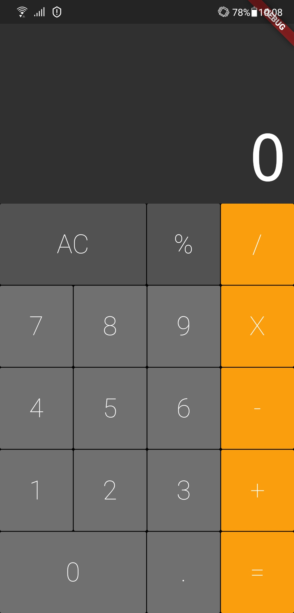
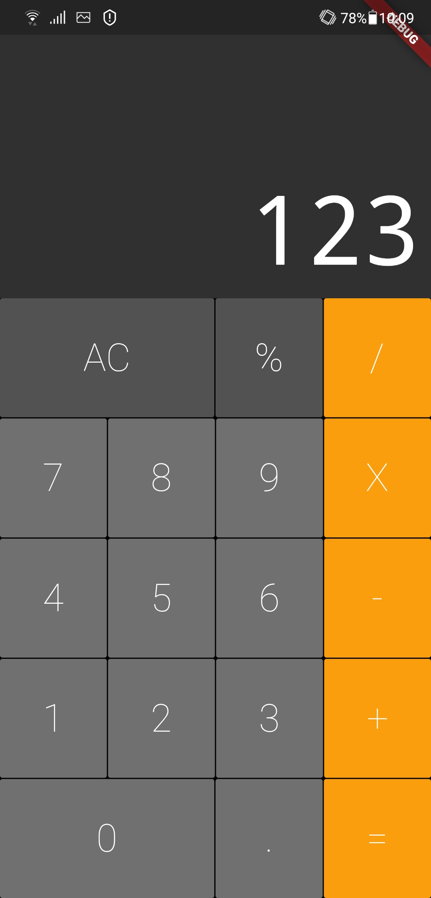

# Calculator

Um pequeno projeto em Flutter que se assemelha a uma calculadora simples de celular

## Descrição

### Tela da Calculadora
Aqui mostramos a calculadora e suas funcões. São funcões basicas

<table>
  <tr>
    <td>Tela sem nada digitado</td>
    <td>Tela com algo digitado</td>
  </tr>
  <tr>
    <td valing="top"></td>
    <td valing="top"></td>
  </tr>
</table>


## Guia
```
git clone https://github.com/alberesdejesus/Calculator-Flutter.git
cd Calculator-Flutter
flutter packages get
flutter run
```
Coloque no seu emulador ou Smartphone e aproveite!! 
